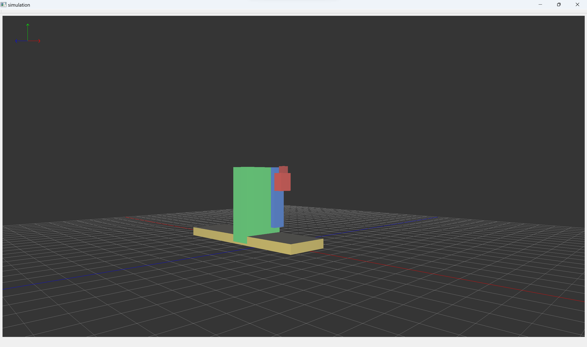

# simulation
一个基于 Qt + OpenGL3.3 + Assimp5.4.3 的开源3D仿真器，模型节点数据采用树形结构存储，可单独对模型的部件进行平移/旋转/缩放等操作。

### 消息

####Version v1.0.1

* `NEW` 新增示例模型，可做测试使用。

####Version v1.0.0

* `NEW` 使用Assmip5.4.3库，支持glb、obj、stl等模型加载。
* `NEW` 拥有层级关系的模型（如glb格式），可单独对某节点进行三维操作。

### 依赖

* [Qt 5.12.0](http://qt-project.org) (LGPL v3.0)
* [Assimp 5.4.3](https://github.com/assimp/assimp/) (3-clause BSD)

### 补充说明

* `1.` 本工程在MSVC-64bit、MinGW-64bit平台下测试通过。
* `2.` libs/assimp-vc141-mtd.dll是MSVC-64bit release版本，若需要在MinGW环境中编译使用，可自行使用cmake进行编译替换。